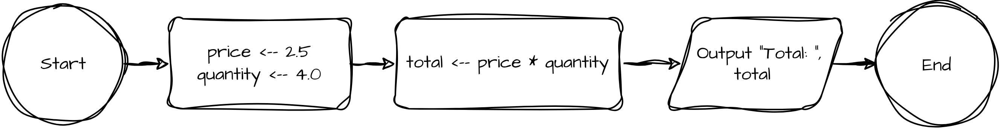

# Debugging Warm-Up 05

This program takes two variables, a quantity and price, multiplies them together, then displays the total.

## Flow Chart



## Pseudocode

```
DECLARE price: FLOAT
DECLARE quantity: FLOAT
DECLARE total: FLOAT

price <-- 2.5
quantity <-- 4.0

total <-- price * quantity

OUTPUT "Total: ", total
```
